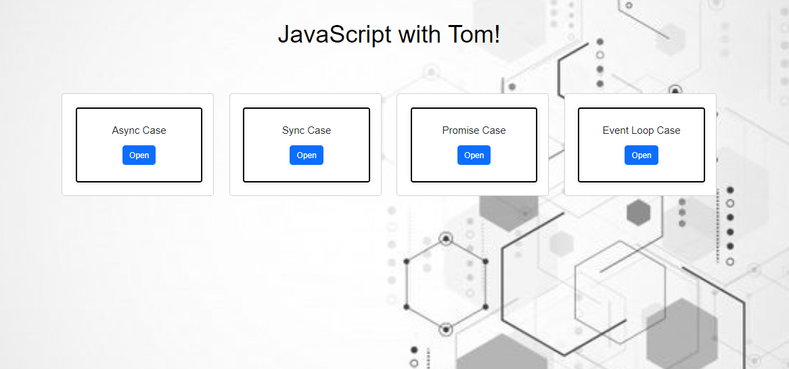
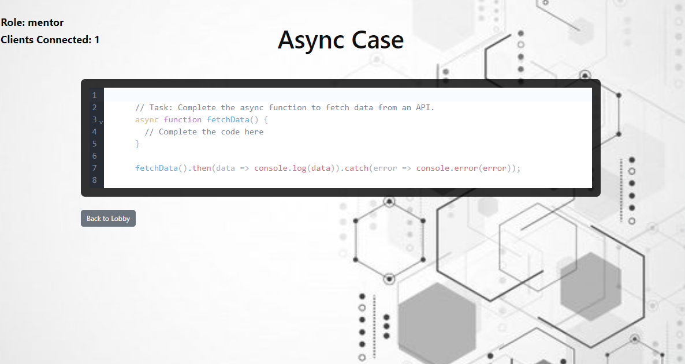
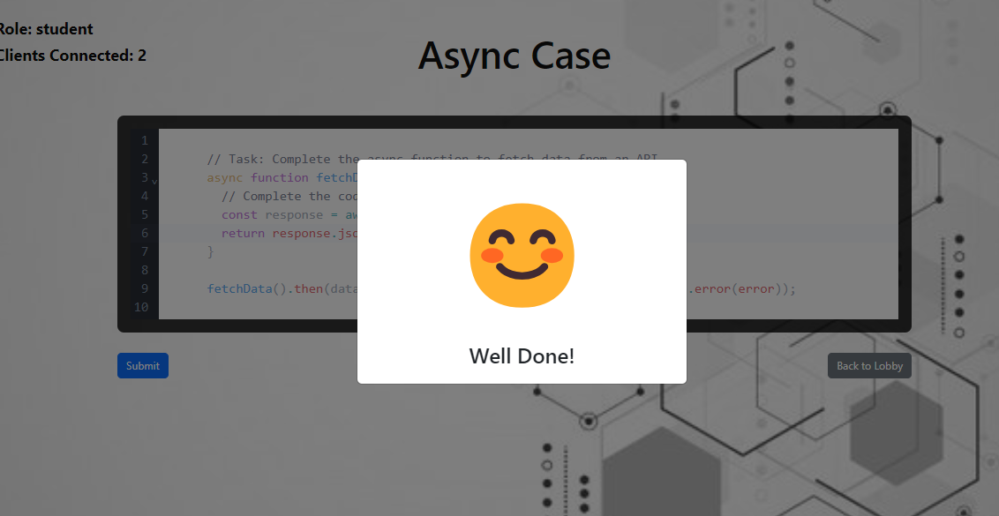

Moveo-Task
The app allows shared viewing of the code when the mentor watches the student write the code in real-time. Other students can also change the code simultaneously.

# Moveo-Task

The app allows shared viewing of the code when the mentor watches the student write the code in real-time. Other students can also change the code simultaneously.

## Program Structure
The program consists of a server side and a client side.

### Running the Server
- **Folder:** `./code_with_me/server`
- **Command:** `npm start`

### Running the Client
- **Folder:** `./code_with_me/client`
- **Command:** `npm start`

All code blocks are saved in MongoDB.

## Client-Side Details
- The lobby page displays a list of the titles of each code block with a link to see the code.

- The first user to enter the code block will be set as a mentor and can watch without editing options.

- When other users log in, they will be defined as students and will be able to edit the code.

**Notice!** Changing the code does not save it in the database!

### Nice Feature
When a user edits the code to the desired form and presses submit, a smiley face will appear to reward their work.

